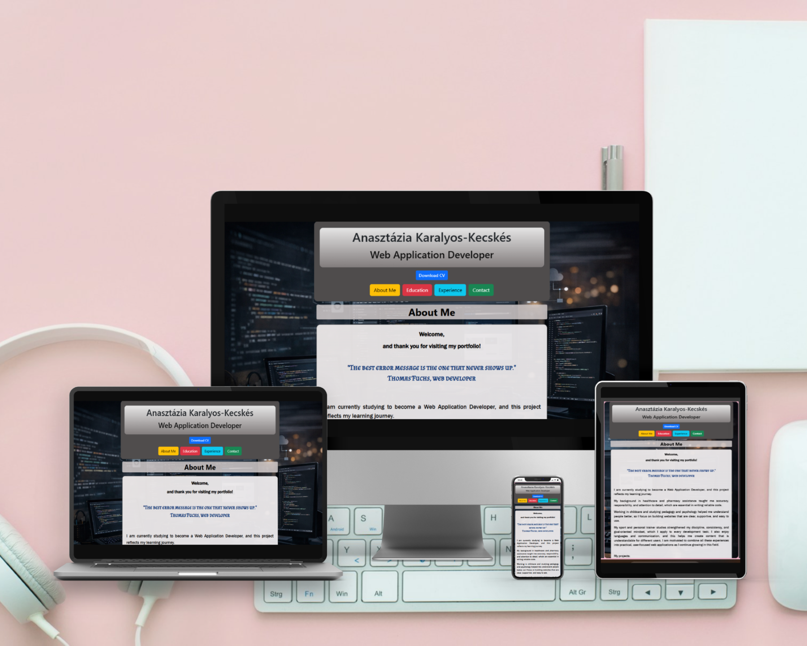
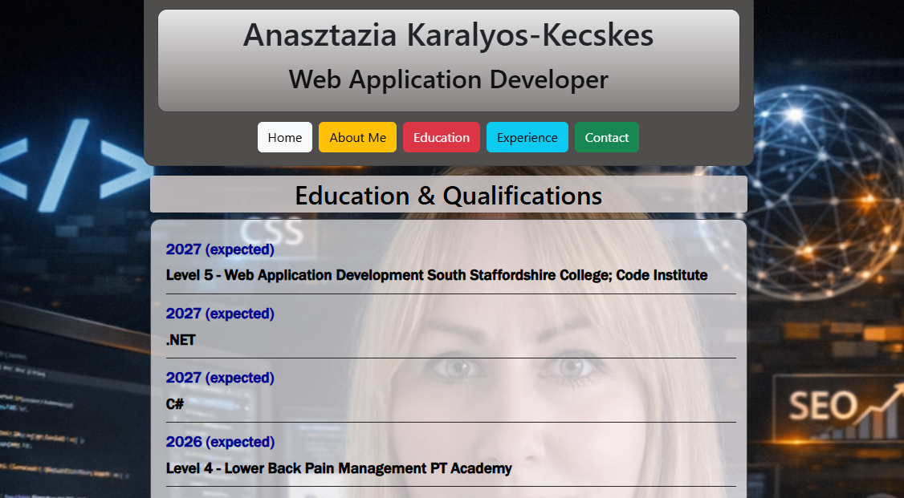
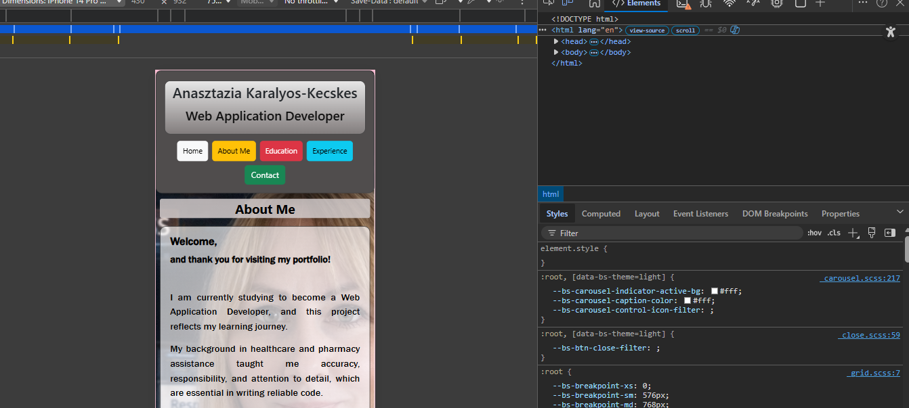
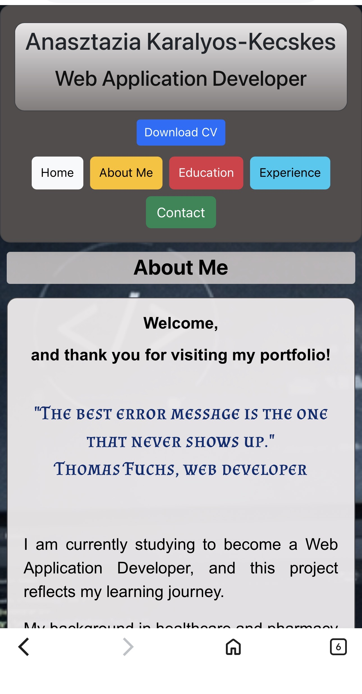
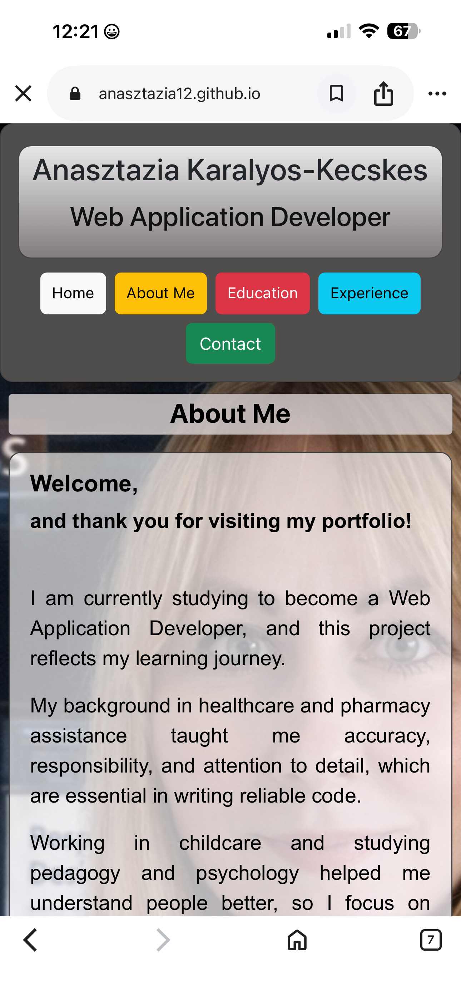
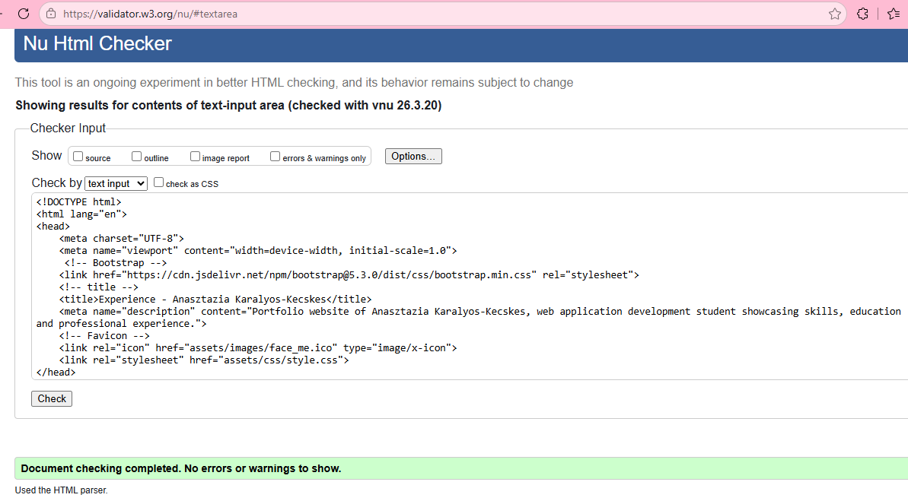
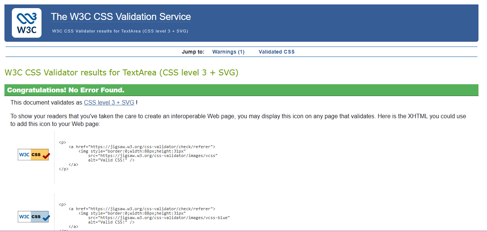
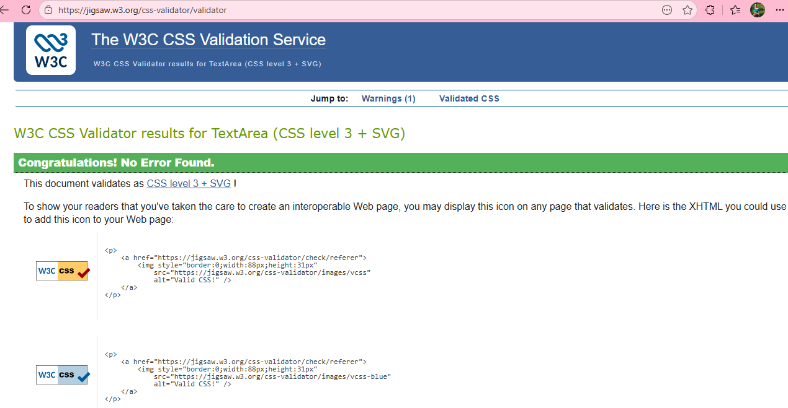
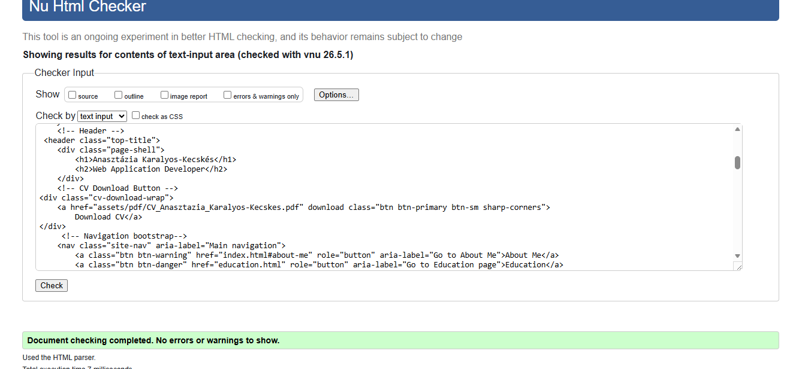

# My CV Website

**GitHub Repository:** [https://github.com/Anasztazia12/cv-project/](https://github.com/Anasztazia12/cv-project/)

Responsive Mockup picture

## 1. Strategy Plane

## Project Overview

This project is a three-page personal CV website created using HTML and CSS.  
The website presents my professional background, education, and experience in a clear and structured format.

The goal of this project is to practice front-end development fundamentals while building a simple but professional portfolio-style website.

---

## Purpose, Value and Deployment

### Purpose of the Application

The purpose of this web application is to provide a clean, accessible, and easy‑to‑navigate online version of my CV.
It demonstrates my ability to structure information using semantic HTML, apply consistent styling with CSS, and create a user‑friendly layout suitable for a personal portfolio.
Additionally, the website is designed to help employers, recruiters, and agencies quickly review my professional background.
By presenting my skills, education, and experience in a clear and organised format, the site makes it easier for them to assess my suitability for potential roles and opportunities.

### Value to Users

The website provides value by offering visitors a quick and organised way to learn about my skills, education, and experience.
Potential employers or collaborators can easily navigate between pages, view my background, and assess my suitability for roles.
The responsive design ensures that the CV is readable on desktop, tablet, and mobile devices.

---

## Development Life Cycle

### a, Planning Phase

At the beginning of the project, I defined the main goal: to create a clean, simple, and easy‑to‑navigate online CV.
During the planning phase,

 I collected all content (profile information, education, experience)

 Decided on a three‑page structure (Home, Education, Experience)

 Created user stories to understand user needs

 identified the essential features (navigation, modal, responsive layout)

The aim was to build a professional and accessible CV website that works well on all devices.

### b, Design Phase

During the design stage, I made decisions about the visual style and layout:

Colour palette: black, white, grey and blue with Bootstrap colorful buttons

Typography: Almendra SC (Google Font) combined with system fonts

Layout: Laptop‑first responsive design using Flexbox and media queries

The design goal was clarity, readability, and a professional CV‑style appearance.

### c, Development Phase

The development process used the following technologies:

HTML5
CSS3
Flexbox
Bootstrap
Google Fonts
Git & GitHub

 Development steps:

 Created the basic HTML structure for all three pages
 Built the navigation menu and linked all pages
 Added content sections (About, Education, Experience)
 Implemented the Bootstrap Contact Modal
 Styled the website using CSS and ensured responsive behaviour
 Added and optimised images
 Performed manual testing on multiple devices
 Fixed layout and functionality issues
 Deployed the project using GitHub Pages
 The focus was on clean, semantic HTML and consistent styling.

### d, Testing Phase

#### Testing

The website was tested on multiple screen sizes to ensure responsiveness and usability.

#### Manual Testing

- Navigation buttons open the correct pages
- Layout adapts correctly to smaller screens
- Navigation buttons stay on one line on mobile as intended
- GitHub lik opens in a new tab
- Contact modal opens correctly when clicked
- Contatc modal closes correctyl using the close button, outside click, ESC key, or X icon.

#### Tested on

- Desktop computer
- Smartphine

#### Screenshots

Testing was carried out manually on different devices and screen sizes.

Tested elements:

Navigation links

Modal opening and closing

Responsive behaviour on mobile and tablet

Image loading

External links

HTML and CSS validation

Detailed results are included in the “Testing” and “Manual Testing Table” sections of this README.

### e, Bugs & Fixes

During development and testing, several issues were identified and resolved:

|Bug|Description|Fix|Status|

---
|Navigation wrapped on mobile|Menu items moved to two line|Added flex-wrap: nowrap in CSS|Fixed|
|Modal didn't close with ESC|Missing Bootstrap behaviour|Re‑checked Bootstrap JS|Fixed|
|Large image file size|Slow loading|Optimised and resized images|Fixed|
|Text spacing inconsistent|Some sections too tight|Adjusted padding and margins|Fixed|

### 6.Deployment

The project is deployed using GitHub Pages.

Steps:

- Push the project to a GitHub repository
- Open the repository settings
- Navigate to the "Pages" section
- Under Source, select the main branch
- Click Save to publish the site

## User Stories

### User Experience Prioritisation

#### Must Have

- As a first-time visitor, I want to immediately understand who this person is so that I can decide whether the CV is relevant to me.
- As a first-time visitor, I want to navigate the site easily so that I can quickly find the information I need.
- As a recruiter, I want to see the candidate’s experience clearly so I can evaluate her suitability for a role.
- As a recruiter, I want to view the education and qualifications in a structured format so that I can verify the candidate’s background.
- As a mobile user, I want the content to adapt to my screen size so that I can read everything comfortably.

#### Should Have

- As a first-time visitor, I want the layout to be clean and readable so, I can scan the content without confusion.
- As a returning visitor, I want to quickly access specific section (Education, Experience, Contact) so that I can review the details again.
- As a returning visitor, I prefer the navigation to be consistent across all pages so that I can move between them without thinking.
- As a mobile user, I want the navigation to be simple and accessible so that I can move between pages easily.

#### Could Have

- As a recruiter, I want the website to load correctly on mobile so that I can see on my phone.

---

## 2. Scope Plane

### Functional Requirements

- Multi-page navigation
- Display of profile image and introduction
- Education and experience sections
- Responsive layout for mobile and tablet
- Contact MODAL

### Non-Functional Requirements

- Clean and readable layout
- Fast loading
- Consistent design across all pages
- Mobile responsiveness

---

## MVP (Minimum Viable Product)

### The MVP includes

- All pages (Home, Education, Experience)
- Navigation menu
- Profile image and introduction
- Education and experience content
- Responsive layout
- Contact information
These features are essential for the website to function as a complete CV.

### Quick Task – Feature Prioritisation Table

|       Feature         |                  Description                                 |      Priority   |
|-----------------------|--------------------------------------------------------------|-----------------|
| Multi-page navigation | User can easily move between the different pages of the site | MVP (essential) |
| Responsive layout     | Layout adapts correctly on mobile and tablet devices         | MVP (essential) |
| Profile + intro       | Home page shows profile image and short introduction         | MVP (essential) |
| Edu & Experience      | Structured info about education and work history             | MVP (essential) |
| Smooth scrolling      | Visual enhancement, not required for core functionality      | Add later       |

---

## 3. Structure Plane

## Project Structure

### Index.html — Home Page

The main landing page of the website. It includes:

- Name and professional title
- Navigation menu linking to all pages
- About Me section
- A short welcome header with a quote
- A short personal introduction
- Key skills
- Contact MODAL

### Education.html — Education

This page lists my educational background and professional certifications.  
Items are displayed in reverse chronological order (most recent first).

- Navigation menu
- Educations, Qualifications
- Contact MODAL

### Experience.html — Professional Experience

This page highlights my previous work experience adn key responsibilities.

- Navigation menu
- Experiences
- Contact MODAL

---

## 4. Skeleton Plane

### Layout and Responsiveness

- Flexbox used for layout
- Navigation buttons stay on one line on all screen sizes (as intended)
- Bootstrap buttons remain clear and easy to tap on smaller screens
- Bootstrap contact modal displays and scales correctly on mobile devices
- Images scale correctly
- Text remains readable on all screen sizes

### Wireframes

Wireframes were planned before development to outline the layout and structure of each page.

---

## 5. Surface Plane

### Visual Design

- Clean, minimalistic layout
- Professional typography using Google Fonts
- Consistent spacing and alignment
- Profile image for personal branding

### Colours and Fonts

- Colours were chosen for readability and simplicity. The palette si mostly black and white, with a bit of blue and Bootstrap’s colourful button styles. This keeps the design clean, clear, and easy to read on all pages.

- Google Fonts used for a modern, professional appearance
The website uses a combination of custom and system fonts: Almendra SC (Google Font),
Franklin Gothic Medium / Arial Narrow / Arial / Sans-serif

- Favicon

### Technologies Used

- HTML5
- CSS3
- Flexbox
- Bootstrap
- Google Fonts
- MarkdownLint

---

## Validator Testing

### HTML Validator

Tested using W3C HTML Validator — no errors found.

Tested on: 23/March/2026

Tested on: 08/April/2026

### CSS Validator

The CSS file was tested using the W3C CSS Validator.
Result: No errors found.

Tested on: 23/March/2026

Tested on: 08/April/2026

 Tested on: 03/05/2026

 

---

## Manual testing table

|      Feature        |      Expected Result       |    Actual Result    |  Pass  |
|---------------------|----------------------------|---------------------|--------|
| Navigation links    | Open correct page          | Works as expected   |   Yes  |
| Mobile layout       | Stacks correctly           | Works               |   Yes  |
| Images load         | All images visible         | Works               |   Yes  |
| Contact links       | Email/phone open correctly | Works               |   Yes  |

### Credits

- Fonts: Google Fonts were used for a clean and modern look. The website uses Almendra SC from Google Fonts, combined with system fonts such as Franklin Gothic Medium, Arial Narrow, Arial, and Sans‑serif.
- Bootstrap for layout support
- All images and screenshots were created by me. The background images were generated with Microsoft Copilot (so there are no copyright issues.)
- Favicon created from my own profile image
- W3C HTML and CSS Validators used for code validation

---

## Thank you for viewing my project
