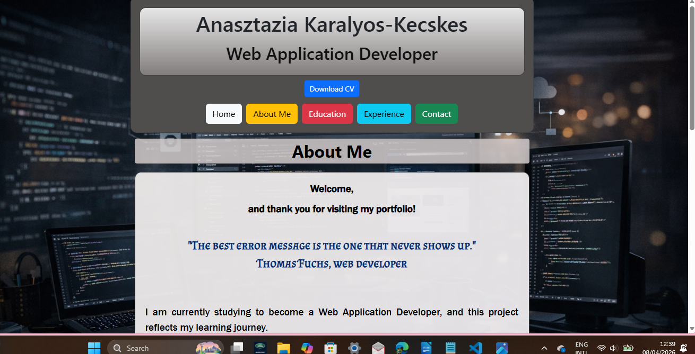
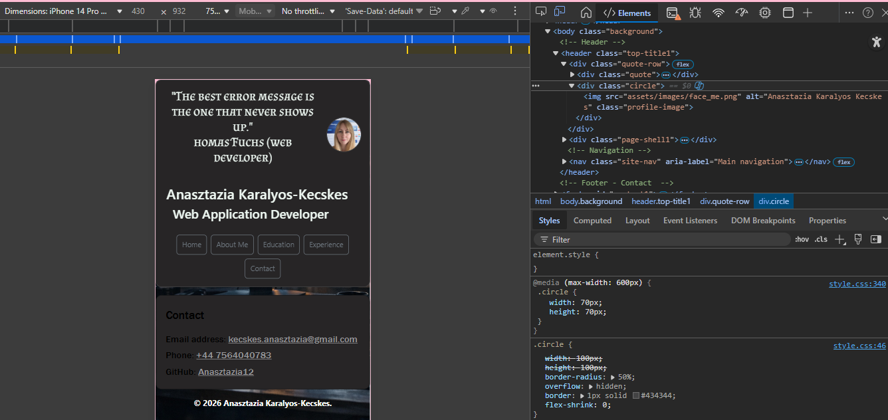
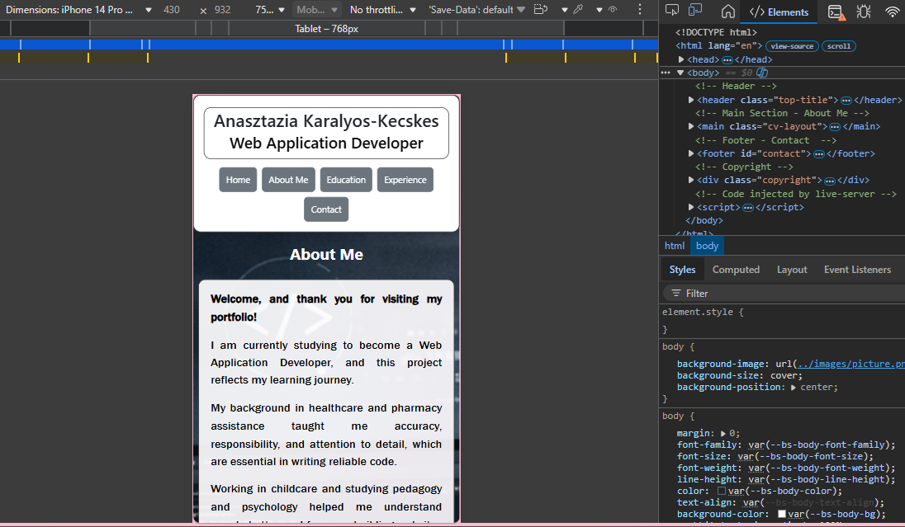
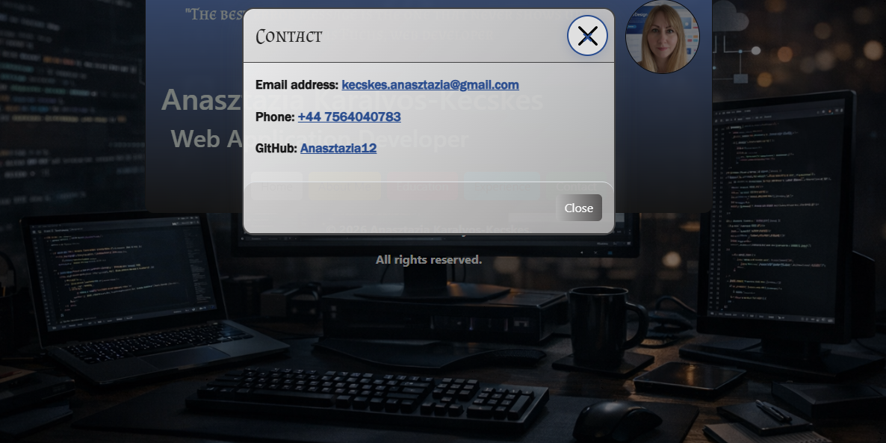
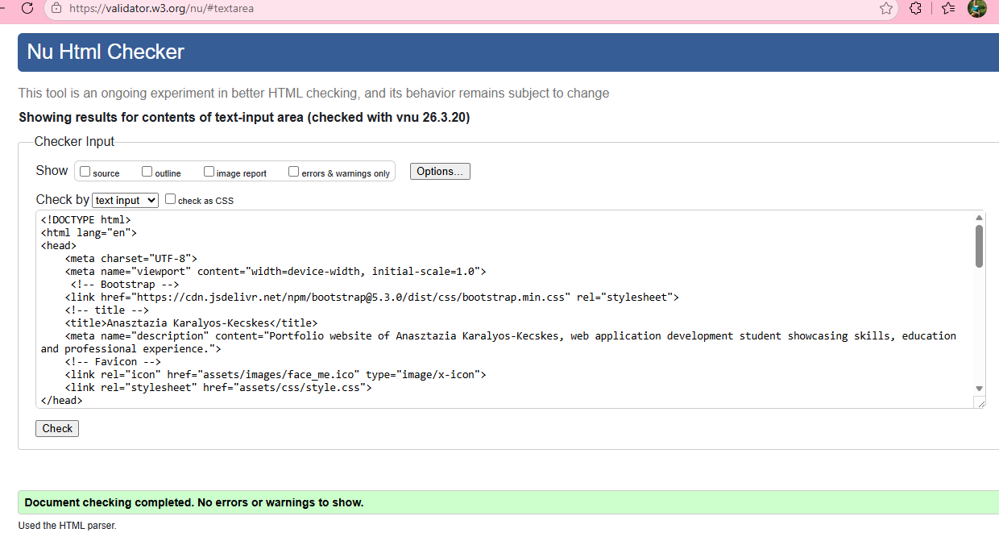
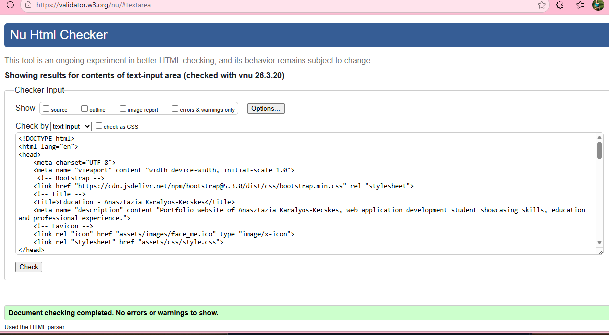
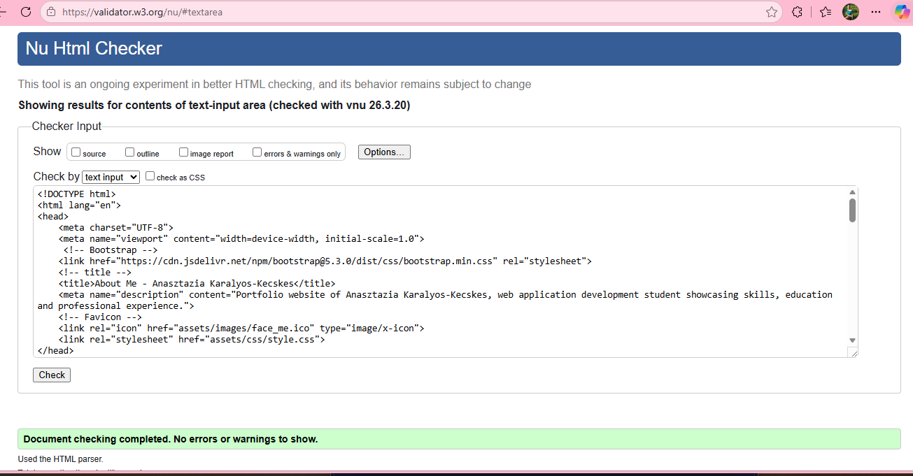

# My CV

## Overview

This project is a three-page personal CV website created using HTML and CSS.  
The website presents my professional background, education, and experience in a clear and structured format.

The goal of this project is to practice front-end development fundamentals while building a simple but professional portfolio-style website.

---

## Project Structure

### Index.html — Home Page

The main landing page of the website. It includes:

- A short welcome header with a quote
- Profile image
- Name and professional title
- Navigation menu linking to all pages
- Contact section in the footer

### About_me.html — About Me

- A short personal introduction
- Key skills
- Profile image
- Navigation menu
- Contact section in the footer

### Education.html — Education

This page lists my educational background and professional certifications.  
Items are displayed in reverse chronological order (most recent first).

- Navigation menu
- Educations, Qualifications
- Contact section in the footer

### Experience.html — Professional Experience

This page highlights my previous work experience and key responsibilities.

- Navigation menu
- Experiences
- Contact section in the footer

---

## Features

The website includes several features designed to improve usability and readability:

- Multi-page navigation structure
- Responsive layout for smaller screens
- Profile image section
- Skills list
- Structured education timeline
- Professional experience cards
- Footer with contact information
- Smooth scrolling navigation

---

## Technologies Used

This project was built using the following technologies:

- HTML5
- CSS3
- Flexbox for layout
- Google Fonts
- MarkdownLint

---

## Testing

The website was tested on multiple screen size to ensure responsiveness and usability.

### Manual Testing

The following elements were tested:

Navigation

- All navigation links correctly open the intended pages.

Responsive Design  

- Layout adapts correctly to smaller screens.  
- Navigation becomes stacked on mobile devices.

Links  

- Email link opens the default email client.  
- Phone link works on mobile devices.  
- GitHub link opens in a new tab.

The website was also tested on a real mobile device (my own smartphone) to confirm proper layout, readability, and usability on a physical device.

- Desktop computer
- Smartphone

This screenshot demonstrates the progress made during the development process.

## Mobile View

This screenshot shows the mobile layout as displayed using the browser’s developer tools.  
It demonstrates how the hero text and navigation adapt to smaller screen sizes.

## Mobile View - On a Smartphone

This screenshot was taken on a real mobile device.  
It confirms that the layout, hero text, and navigation display correctly on an actual phone screen.

### Testing Tools

Testing was performed using the browser’s Developer Tools (Responsive Design Mode) to simulate different screen sizes and devices.

## Deployment

The project is deployed using GitHub Pages.

Deployment steps:

1. Upload the project to a GitHub repository
2. Open the repository settings
3. Navigate to the "Pages" section
4. Select the main branch as the source
5. Save and publish

The site becomes available via a public GitHub Pages link.

---

## Future Improvements

Possible future improvements include:

- Adding JavaScript interactivity
- Improving animations and visual effects
- Expanding the portfolio with projects
- Adding a contact form
- Improving accessibility features

---

## User Experience (UX)

### User Stories

### First-Time Visitor Goals

- As a first-time visitor, I want to immediately understand who is this person so that I can decide whether the CV is relevant to me.
- As a first-time visitor, I want to navigate the site easily so that I can quickly find the information I need.
- As a first-time visitor, I want the layout to be clean and readable so that I can scan the content without confusion.

### Returning Visitor Goals

- As a returning visitor, I want to quickly access specific section (Education, Experience, Contact) so that I can review details again.
- As a returning visitor, I prefer if the navigation to be consistent across all pages, so that I can move between them without thinking.

### Recruiter / Employer Goals

- As a recruiter, I would like to see the candidate’s experience clearly, so that I can evaluate their suitability for a role.
- As a recruiter, I want to view the education and qualifications in a structured format so that I can verify the candidate’s background.
- As a recruiter, I want the website to load correctly on mobile so that I can check it quickly on my phone.

### Mobile User Goals

- As a mobile user, I want the content to adapt to my screen size so that I can read everything comfortably.
- As a mobile user, I want the navigation to be simple and accessible so that I can move between pages easily.

### General User Goals

- As a user, I want the design to be visually appealing so that the site feel professional and trustworthy.
- As a user, I want the contact information so be easy to find so that I can reach out if needed.

---

## Validator

### HTML Validator

The HTML files were tested using the W3C HTML Validator.
Result: No errors found.

## CSS Validator

The CSS file was tested using the W3C CSS Validator.
Result: No errors found.

## Manual testing table

|      Feature        |      Expected Result       |    Actual Result    |  Pass  |
|---------------------|----------------------------|---------------------|--------|
| Navigation links    | Open correct page          | Works as expected   |   Yes  |
| Mobile layout       | Stacks correctly           | Works               |   Yes  |
| Images load         | All images visible         | Works               |   Yes  |
| Contact links       | Email/phone open correctly | Works               |   Yes  |

## Credits

- Fonts were provided by Google Fonts.
- Bootstrap was used for button styling and layout support.
- All images used in the project (profile photo and screenshots) were created by me.
- Favicon was created from my own profile image.
- W3C HTML and CSS Validators were used for code validation.
